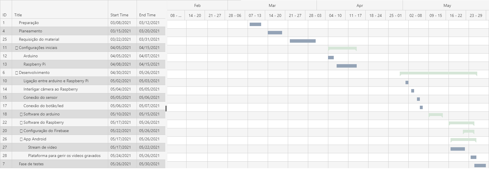

# Câmara na campainha

## Tabela de conteúdos
1. [Introdução](#introducao)
2. [Requisitos](#requisitos) 
3. [Timeline](#timeline)
4. [Desenvolvimento](#desenvolvimento)

## Introdução

A presente documentação tem como objetivo a exposição do desenvolvimento projeto __Câmara na campainha__, elaborado no âmbito da unidade curricular de Sistemas Embutidos. Este projeto consiste no desenvolvimento de uma campainha inteligente, através da instalação de uma câmara de infravermelhos na porta da residência, um botão que simulará a campainha, e um sensor de movimento cuja função será detetar a presença de pessoas na entrada da casa/apartamento. Após ser detetada alguma atividade na entrada do domicílio, ou ao ser pressionado o botão, a câmara será ativada, gravando e emitindo imagens a tempo real para o *smartphone* do dono da propriedade. Além do utilizador poder realizar um pedido de uma *livestream* após receber notificação de atividade na sua entrada, este também tem a possibilidade de visualizar e apagar todos os vídeos *stop-motion* captadas pela câmara.

## Requisitos

### Requisitos Funcionais
- O sistema deverá captar imagens gravadas com "stop-motion" através de uma câmara instalada na porta de uma casa/apartamento. Esta câmara será ativada no momento de deteção de movimento pelo sensor ou após um clique no botão que representa a campainha da residência.
- Deve haver uma luz vermelha a indicar que a câmara está a gravar.
- Após passados 5 minutos de deixar de detetar alguém, o sistema deverá parar.
- Posteriormente à ocorrência de um toque na campainha, o utilizador deverá ser notificado do acontecimento no seu smartphone.
- A partir do seu smartphone, o utilizador que recebeu notificação poderá requisitar uma stream de vídeo sem "stop-motion".
- No smartphone deve também ser possível visualizar os vídeos "stop-motion" gravados pela câmara e apagar os mesmos.

### Requisitos Não Funcionais

- A deteção de presença de um índividuo na porta pelo sensor deverá ser inferior a 3 segundos.
- Após a deteção de presença ou um toque na campainha, o início de gravação deverá ser inferior a 3 segundos.
- O pedido de stream de vídeo do smartphone do utilizador deverá ter um atraso inferior a 10 segundos.
- A presença física de uma pessoa pelo sensor de movimento terá de ser detetada a uma distância mínima de 50 centímetros.

## Timeline

## Desenvolvimento

### Milestones

#### Arduino

1. Implementação das configurações iniciais do Arduino
2. Elaboração de maquete do circuito com a interligação entre todos os componentes, fazendo uso do **Tinkercad**
3. Configuração do sensor de movimento e implementação do código no Arduino IDE. 

#### Raspberry Pi

1. Configurações iniciais
2. ...

#### Android

1. Criação de projeto no Android Studio
2. Configuração do ecrã inicial.
3. Implementação do ExoPlayer para visualização de vídeos
4. Configuração da área de gestão de vídeos *stop-motion*

### Atrasos/Remodelações

Devido à falta de material e atraso de levantamento, nomeadamente da *Raspberry Camera Board*, foi necessária a adaptação para uma câmara de infravermelhos do Raspberry Pi - NoIR Camera V2.

## Documentação dos componentes

### Protocolos